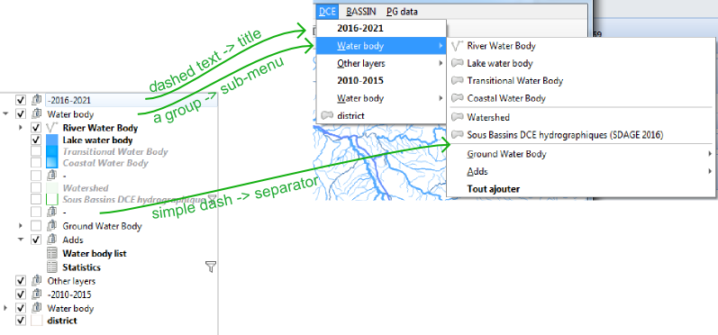
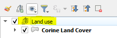
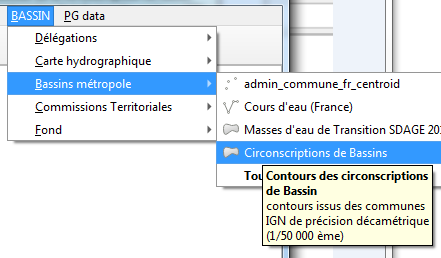
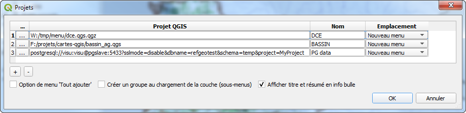
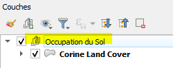

# {{ title }} - Documentation

> **Author and contributors:** {{ author }}
>
> **Version:** {{ version }}
>
> **Source code:** {{ repo_url }}

## Table of Contents

- [English version](#english-version)

  - [How to use it ?](#how-to-use-it)
    - [1. Set up a classical qgis project somewhere](#set-up-a-classical-qgis-project-somewhere)
    - [2. Configure the plugin to read those projects](#configure-the-plugin-to-read-those-projects)

- [En Français](#en-francais)
  - [Comment l'utiliser ?](#comment-lutiliser)
    - [1. Construire un beau projet](#construire-de-beaux-projets)
    - [2. Configurer le plugin](#configurer-le-plugin)

```{toctree}
---
maxdepth: 1
caption: Others
---
history.md
On QGIS Plugins repository <https://plugins.qgis.org/plugins/menu_from_project/>
```

## English version

That plugin provides a convenient way to add prestyled and preconfigured frequently used layers using dropdown menus built by simply reading existing QGIS projects (qgs, qgz, postgres, http)

Styling, actions, labeling, metadata, joined layers are reused as defined in source projects


### How to use it ?

When the plugin is configured (choice of a project via the plugin menu), a new menu appears, based on all the layers that contain the original project.

#### 1. Set up a classical qgis project somewhere

Save a project somewhere with some styling, labeling, and so on.

The project might be stored in a PostgreSQL database, or on a web server, which makes it accessible via http. [(see feature-saving-and-loading-projects-in-postgresql-database)](https://qgis.org/en/site/forusers/visualchangelog32/index.html#feature-saving-and-loading-projects-in-postgresql-database). You need to copy/paste the project URI (Project properties -> General) into the field.

...and QGZ [(see feature-new-zipped-project-file-format-qgz)](https://qgis.org/en/site/forusers/visualchangelog30/index.html#feature-new-zipped-project-file-format-qgz).

If you want some hierarchical menu, just use groups and sub groups in layer's panel, they will be reused to build the same hierarchical menu.

```{tip}
Create an empty group named "-" to build a separator line in dropdown menu
```

```{note}
If you want users to access that project, save it to a shared network place, better read only fo users except for the project administrator. Using a version control system could be a very good idea here.
```



#### 2. Configure the plugin to read those projects

- Go to menu / Plugins / Layer menu from project :


- Press "+" button to add a .qgs, .qgz project to the list (or paste a pg URI, a http URL).
  You can change the alias that will be the menu name in QGIS

The name will become the title of the menu.

The menu can be placed either in the main menu bar, or in the "layer / add layer" sub-menu, or (since version 1.1) to be merged with the previous project in the same menu.

Following options are available:

- _Show title and abstract in tooltip_ : this is a convenient way to show some metadata to end users before they add it o the working session even if they don't know that metadata are available in layer properties

- _Load all layers item_: adds an entry at the end of every menu's node that allow user to load all menu items at once. Very useful when you want to load all topo maps for every zoom level for instance.




- _Create Group_ : Layer will be added inside a group, taking the name of the menu node.

You can hide the administration dialog of the plugin by adding a `menu_from_project/is_setup_visible` to `false` in the QGIS INI file. This is useful when you deploy QGIS within an organization.

---

## En Français

Cette extension pour QGIS permet de construire automatiquement des menus déroulants permettant d'ajouter des couches pré-stylées définies dans des projets QGIS externes "modèles" (qgs, qgz, postgres, web).

Tous les paramètrages des couches, le style, les étiquettes, les actions, les métadonnées, les jointures sont conservées. La maintenance se résume à la gestion de quelques projets QGIS centralisés.



### Comment l'utiliser ?

Lorsque le plugin est configuré (choix des projets et attribution d'un nom associé via le menu Extensions - Layers menu from projects), de nouveaux menus apparaissent, pour chacun des projets sélectionnés. Chaque item de menu correspond alors à une couche du projet et déclenche son ouverture.

#### 1. Construire de beaux projets

Sauver vos projets sur un espace partagé (réseau, web, postgres) avec leurs styles, leurs étiquettes... une arborescence de groupes à l'image du futur menu.

```{tip}
Créer un groupe vide nommé "-" pour placer un séparateur à cet endroit dans le futur menu.
```

Les projets peuvent être sauvés au format qgz, dans une base PostgreSQL [(cf. feature-saving-and-loading-projects-in-postgresql-database)](https://qgis.org/en/site/forusers/visualchangelog32/index.html#feature-saving-and-loading-projects-in-postgresql-database) ou déposée en tant que ressource web.

```{note}
Le projet placé dans un espace partagé du réseau, sous postgres ou un serveur web permettra à différents utilisateurs d'exploiter les mêmes ressources (à condition bien sûr que celles-ci soit accessible).
```


#### 2. Configurer le plugin

- menu / Extension / Layer menu from project :




- Bouton ajouter un projet ("+"), puis "éditer" pour ajouter un projet .qgs, .qgz à la liste, ou coller l'URI d'un projet PostgreSQL, coller l'URL d'un projet distant. ex : http://adour-garonne.eaufrance.fr/upload/DATA/SIG/aeag-web.qgz

Le nom (modifiable), deviendra le titre du menu.

Le menu pourra être placé soit dans la barre de menu principale, soit dans le sous-menu "couche / ajouter une couche", ou encore (depuis la version 1.1) d'être fusionné avec le projet précédent dans un même menu.

Quelques options :

- L'option du plugin "option de menu 'tout ajouter'", si elle est cochée permet de charger l'ensemble des couches d'un même niveau de sous-menu




- L'option "Créer un groupe au chargement de la couche" place la nouvelle couche sous un groupe portant le nom du menu

- Afficher titre et résumé... assez parlant.

Vous pouvez cacher la fenêtre d'administration du plugin en ajoutant une variable `menu_from_project/is_setup_visible` à `false` dans le fichier INI de QGIS. Ceci est utile quand QGIS est déployé au sein d'une organisation.
