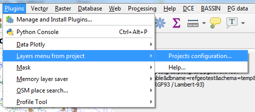
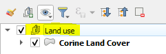
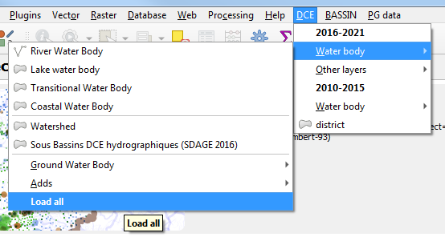

# 🇬🇧 QGIS Plugin: *Layers Menu from Project*

**Create custom menus to add pre-styled layers with just one click!**

```{toctree}
---
maxdepth: 3
caption: Table of Contents
---
try_it
with_qdt
```

## What is it for?

This plugin lets you **create menus** in QGIS to easily add **pre-configured** layers (styles, labels, metadata, relationships, etc.) from projects:
- **files** (`.qgs`, `.qgz`)
- stored in a **PostgreSQL database**
- or hosted online (a **URL**).

**Benefits**: ✔ **Time savings**: No need to restyle layers with every import.
✔ **Centralization**: Modify a “template” project to update all users.
✔ **Flexibility**: Customizable menus (location, cache, options).


## 1. Prepare your “template” projects
For the plugin to work, organize your projects as follows:
1. **Structure your layers** into **groups** (these will become submenus).
   - *Tip*: Create an empty group named `“-”` to add a **separator** to the future menu.
2. **Save the project** to an accessible location:
   - Local network, PostgreSQL, or web server (for multi-user sharing).
   - Supported formats: `.qgs`, `.qgz`, or PostgreSQL project.


## 2. Configure the plugin

### Access the configuration
1. Go to **Extensions > Layers menu from project > Configure**.
2. The configuration window opens:


### Key steps
1. Add a project:
   - Click `+` and select a `.qgs`/`.qgz` file, or paste a **URL** (e.g., `https://exemple.com/projet.qgz`) or a **PostgreSQL URI**.
   - *Option*: Give the menu a **custom name** (otherwise, the file name will be used).

2. Choose the menu location:
   - Under *Layer > Add Layer*
   - Main menu bar
   - In the *QGIS Explorer* (or browser - sorted alphabetically).
   - or merged with the previous project into the same menu/explorer.

3. Enable the cache (recommended):
   - **Disabled**: The menu updates every time QGIS is opened.
   - **Enabled**:
     - *No interval*: The menu remains static (unless you clear the cache manually).
     - *With interval* (e.g., 7 days): Automatic refresh.

   - *To force an update*:
     Create a JSON file (e.g., `last_release.json`) on a network share with the last modification date:
     ```json
     {"last_release": "02/26/2026 12:00:00"}
     ```

4. Advanced Options:
   - **Create a group**: Added layers will be placed in a group.
   - **Open related layers**: Also loads related layers (joins, relationships).
   - **“Add All” button**: Allows you to load all layers from a submenu at once.
   - **Tooltips**: Displays metadata when hovering over items.
   - **Hide configuration**: Useful for enterprise deployment via the QGIS INI file: by setting the variable `menu_from_project/is_setup_visible` to `false` in the QGIS INI file.


# 🇬🇧 How to use the plugin Layers menu from project

```{toctree}
---
maxdepth: 3
caption: Table of contents
---
try_it
with_qdt
```

----

That plugin provides a convenient way to add prestyled and preconfigured frequently used layers using dropdown menus built by simply reading existing QGIS projects (qgs, qgz, postgres, http)

Styling, actions, labeling, metadata, joined layers and relations are reused as defined in source projects.


When the plugin is configured (choice of a project via the plugin menu), a new menu appears, based on all the layers that contain the original project.

## 1. Set up a classical QGIS project somewhere

Save a project somewhere with some styling, labeling, and so on.

The project might be stored in a PostgreSQL database, or on a web server, which makes it accessible via http. [(see feature-saving-and-loading-projects-in-postgresql-database)](https://qgis.org/en/site/forusers/visualchangelog32/index.html#feature-saving-and-loading-projects-in-postgresql-database). You need to copy/paste the project URI (Project properties -> General) into the field.

...and QGZ [(see feature-new-zipped-project-file-format-qgz)](https://qgis.org/en/site/forusers/visualchangelog30/index.html#feature-new-zipped-project-file-format-qgz).

If you want some hierarchical menu, just use groups and sub groups in layer's panel, they will be reused to build the same hierarchical menu.

```{tip}
Create an empty group named "-" to build a separator line in dropdown menu. This is not supported for QGIS browser.
```

```{note}
If you want users to access that project, save it to a shared network place, better read only fo users except for the project administrator. Using a version control system could be a very good idea here.
```


----

## 2. Configure the plugin to read those projects

1. Go to menu / Plugins / Layer menu from project :

    

1. The plugin's configuration dialog appears:

    

1. Press `+` button to add a .qgs, .qgz project to the list (or paste a PostgreSQL URI, a HTTP URL).
1. You can change the alias that will be the menu name in QGIS

The name will become the title of the menu.

### Destination location

The menu can be placed either in the main menu bar, or in the "layer / add layer" sub-menu, or in QGIS browser (since version 2.3.0). Since version 1.1 it can also be merged with the previous project in the same menu/browser.

For QGIS browser, layers and group can only be displayed alphabetically. Order from project won't be kept and in case of merge, the layers and group will be mixed.

### Cache configuration

Using the cache (disabled by default) significantly reduces menu generation time. It can be configured differently for each project/menu.

If your project is stable, feel free to increase the refresh interval, after which the project will be analyzed again and the menu updated.

In summary:

- Cache disabled : the menu is refreshed when QGIS is opened
- Cache enabled + interval "None" : the menu is never refreshed (except when the cache is cleared).
- Cache enabled + interval >= 1 day : refreshed according to this interval.

### Advanced cache options

The 'cache' folder contains the date of the last refresh; a second file contains the menu structure. Deleting this file will force a refresh.

A mechanism based on the existence of a validation file allows for forcing a cache refresh. This file, located on a network drive, will allow, for example, an administrator who has modified a project/menu to force a menu update for all user profiles by changing the date in this file, which has the following JSON structure:

```json
{
    "last_release": "26/02/2026 12:00:00"
}
```

### Global options

#### Create Group

Layer will be added inside a group, taking the name of the menu or sub-menu node.



#### Also load linked layers

If relations or joins are defined, the opening of a layer will be accompanied by the opening of the associated child layers.

#### Load all layers item

Adds an entry at the end of every menu's node that allow user to load all menu items at once. Very useful when you want to load all topo maps for every zoom level for instance.



#### Tooltip

Activates the tooltip when hovering over a menu item. The data comes from layer metadata, OGC information, and layer notes. Clicking on one of the sources adjusts the priority order.

#### Hide configuration dialog

You can hide the administration dialog of the plugin by adding a `menu_from_project/is_setup_visible` to `false` in the QGIS INI file. This is useful when you deploy QGIS within an organization:

```ini
[...]
menu_from_project/is_setup_visible=false
[...]
```
