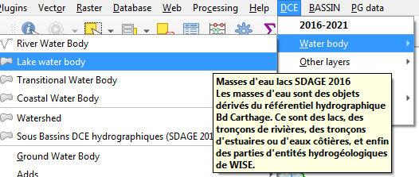
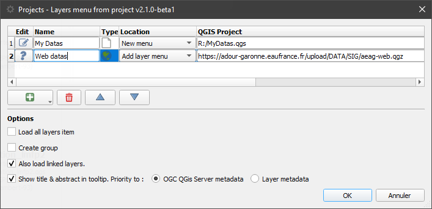

# 🇬🇧 QGIS Plugin: *Layers Menu from Project*

**Create custom menus to add pre-styled layers with just one click!**

```{toctree}
---
maxdepth: 3
caption: Table of Contents
---
try_it
with_qdt
```

## What is it for?

This plugin lets you **create menus** in QGIS to easily add **pre-configured** layers (styles, labels, metadata, relationships, etc.) from projects:
- **files** (`.qgs`, `.qgz`)
- stored in a **PostgreSQL database**
- or hosted online (a **URL**).

**Benefits**: ✔ **Time savings**: No need to restyle layers with every import.
✔ **Centralization**: Modify a “template” project to update all users.
✔ **Flexibility**: Customizable menus (location, cache, options).





## 1. Prepare your “template” projects
For the plugin to work, organize your projects as follows:
1. **Structure your layers** into **groups** (these will become submenus).
   - *Tip*: Create an empty group named `“-”` to add a **separator** to the future menu.
2. **Save the project** to an accessible location:
   - Local network, PostgreSQL, or web server (for multi-user sharing).
   - Supported formats: `.qgs`, `.qgz`, or PostgreSQL project.


## 2. Configure the plugin

### Access the configuration
1. Go to **Extensions > Layers menu from project > Configure**.
2. The configuration window opens:



### Key steps
1. Add a project:
   - Click `+` and select a `.qgs`/`.qgz` file, or paste a **URL** (e.g., `https://exemple.com/projet.qgz`) or a **PostgreSQL URI**.
   - *Option*: Give the menu a **custom name** (otherwise, the file name will be used).

2. Choose the menu location:
   - Under *Layer > Add Layer*
   - Main menu bar
   - In the *QGIS Explorer* (or browser - sorted alphabetically).
   - or merged with the previous project into the same menu/explorer.

3. Enable the cache (recommended):
   - **Disabled**: The menu updates every time QGIS is opened.
   - **Enabled**:
     - *No interval*: The menu remains static (unless you clear the cache manually).
     - *With interval* (e.g., 7 days): Automatic refresh.

   - *To force an update*:
     Create a JSON file (e.g., `last_release.json`) on a network share with the last modification date:
     ```json
     {"last_release": "02/26/2026 12:00:00"}
     ```

4. Advanced Options:
   - **Create a group**: Added layers will be placed in a group.
   - **Open related layers**: Also loads related layers (joins, relationships).
   - **“Add All” button**: Allows you to load all layers from a submenu at once.
   - **Tooltips**: Displays metadata when hovering over items.
   - **Hide configuration**: Useful for enterprise deployment via the QGIS INI file: by setting the variable `menu_from_project/is_setup_visible` to `false` in the QGIS INI file.
