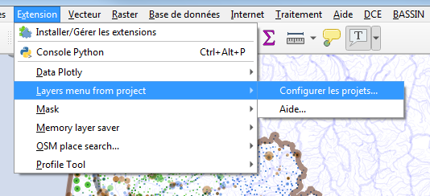
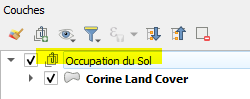
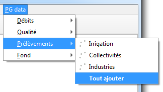

# 🇫🇷 Utiliser le plugin Layers menu from project

```{toctree}
---
maxdepth: 3
caption: Table des matières
---
try_it
with_qdt
```

----

Cette extension pour QGIS permet de construire automatiquement des menus déroulants permettant d'ajouter des couches pré-stylées définies dans des projets QGIS externes "modèles" (qgs, qgz, postgres, web).

Tous les paramètrages des couches, le style, les étiquettes, les actions, les métadonnées, les jointures et relations sont conservées. La maintenance se résume à la gestion de quelques projets QGIS centralisés.


Lorsque le plugin est configuré (choix des projets et attribution d'un nom associé via le menu Extensions - Layers menu from projects), de nouveaux menus apparaissent, pour chacun des projets sélectionnés. Chaque item de menu correspond alors à une couche du projet et déclenche son ouverture.

## 1. Construire de beaux projets

Sauver vos projets sur un espace partagé (réseau, web, postgres) avec leurs styles, leurs étiquettes... une arborescence de groupes à l'image du futur menu.

```{tip}
Créer un groupe vide nommé "-" pour placer un séparateur à cet endroit dans le futur menu. Ceci n'est pas supporté pour l'explorateur QGIS.
```

Les projets peuvent être sauvés au format qgz, dans une base PostgreSQL [(cf. feature-saving-and-loading-projects-in-postgresql-database)](https://qgis.org/en/site/forusers/visualchangelog32/index.html#feature-saving-and-loading-projects-in-postgresql-database) ou déposée en tant que ressource web.

```{note}
Le projet placé dans un espace partagé du réseau, sous postgres ou un serveur web permettra à différents utilisateurs d'exploiter les mêmes ressources (à condition bien sûr que celles-ci soit accessible).
```


----

## 2. Configurer le plugin

1. menu `Extensions` / `Layer menu from project` :

    

1. L'interface de configuration s'ouvre :

    

1. Cliquer sur `+` pour ajouter un projet .qgs, .qgz à la liste, ou coller l'URI d'un projet PostgreSQL ou coller l'URL d'un projet distant. ex : <https://adour-garonne.eaufrance.fr/upload/DATA/SIG/aeag-web.qgz>
1. Il est possible de donner un alias qui deviendra le nom du menu. Sion c'est le titre du projet qui est utilisé.

Le nom (modifiable), deviendra le titre du menu.

### Emplacement de destination

Le menu pourra être placé soit dans la barre de menu principale, soit dans le sous-menu "couche / ajouter une couche", soit dans l'explorateur QGIS. Depuis la version 1.1 il peut être fusionné avec le projet précédent dans un même menu/explorateur.

Pour l'explorateur QGIS, les couches et les groupes ne peuvent être qu'affichés par ordre alphabétique. L'ordre indiqué dans le projet ne sera pas préservé en cas de fusion et les couches et groupes seront mélangés.

### Configuration du cache

L'utilisation du cache raccourci considérablement le temps de construction des menus. Il peut se configurer différemment pour chaque projet/menu.

Si votre projet est stable, n'hésitez pas à augmenter l'intervalle de rafraîchissement, à l'issue duquel le projet sera à nouveau analysé et le menu ainsi actualisé.

En résumé :

- Cache désactivé : le menu est actualisé à l'ouverture de QGIS
- Cache activé + intervalle "None" : le menu n'est jamais actualisé, sauf à videz le dossier 'cache'.
- Cache activé + intervalle (>= 1 jour) : actualisation selon cette fréquence.

### Options avancées du cache

Le dossier 'cache' contient la date du dernier rafraîchissement, un deuxième fichier contient la structure des menus. Il peut être effacé, cela forcera le rafraîchissement.

Un mécanisme basé sur l'existence d'un fichier de validation permet de forcer le rafraîchissement du cache. Ce fichier, placé sur un espace du réseau permettra par exemple à un administateur qui a modifié un projet/menu de forcer l'actualisation du menu sur l'ensemble des profils utilisateurs, en modifiant la date dans ce fichier à structure JSON suivante :

```json
{
    "last_release": "26/02/2026 12:00:00"
}
```

### Options générales

#### Créer un groupe au chargement de la couche

Place la nouvelle couche sous un groupe portant le nom du menu ou sous-menu parent :



#### Ouvrir aussi les couches liées

Si des relations ou jointures sont définies, l'ouverture d'une couche s'accompagnera de l'ouverture des couches filles associées.

#### Option de menu 'Tout ajouter'

Si elle est cochée permet de charger l'ensemble des couches d'un même niveau de sous-menu :



#### Info bulle

Active l'info-bulle au survol d'un item de menu. Les données sont issues des méta-données de couche, des infos 'OGC', des notes de couches. En cliquant sur l'une des sources, l'ordre de priorité est ajusté.

#### Masquer la fenêtre de configuration du plugin

Vous pouvez cacher la fenêtre d'administration du plugin en ajoutant une variable `menu_from_project/is_setup_visible` à `false` dans le fichier INI de QGIS. Ceci est utile quand QGIS est déployé au sein d'une organisation.
