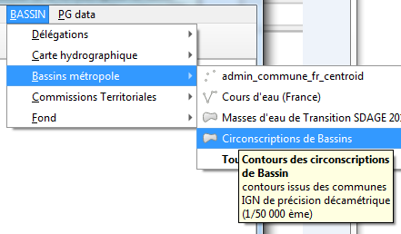
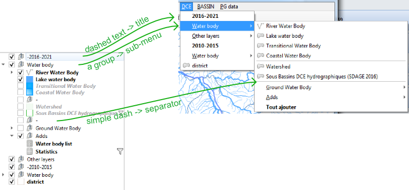
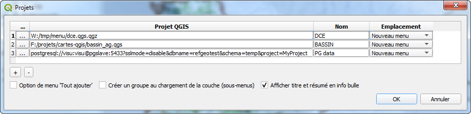

# 🇫🇷 Plugin QGIS : *Layers Menu from Project*

**Créez des menus personnalisés pour ajouter des couches pré-stylisées en 1 clic !**

```{toctree}
---
maxdepth: 3
caption: Table des matières
---
try_it
with_qdt
```

## À quoi ça sert ?

Ce plugin permet de **créer des menus** dans QGIS pour ajouter facilement des couches **déjà configurées** (styles, étiquettes, métadonnées, relations, etc.) depuis des projets :
- **fichiers** (`.qgs`, `.qgz`)
- stockés en **base PostgreSQL**
- ou hébergés en ligne (une **URL**).

**Avantage** : ✔ **Gain de temps** : Plus besoin de re-styler les couches à chaque import.
✔ **Centralisation** : Modifiez un projet "modèle" pour mettre à jour tous les utilisateurs.
✔ **Flexibilité** : Menus personnalisables (emplacement, cache, options).





## 1. Préparer vos projets "modèles"
Pour que le plugin fonctionne, organisez vos projets comme suit :
1. **Structurez vos couches** avec des **groupes** (ils deviendront des sous-menus).
   - *Astuce* : Créez un groupe vide nommé `"-"` pour ajouter un **séparateur** dans le futur menu.
2. **Enregistrez le projet** dans un emplacement accessible :
   - Réseau local, PostgreSQL, ou serveur web (pour un partage multi-utilisateurs).
   - Formats supportés : `.qgs`, `.qgz`, ou projet PostgreSQL.




## 2. Configurer le plugin
### Accéder à la configuration
1. Allez dans **Extensions > Layers menu from project > configurer**.
2. La fenêtre de configuration s'ouvre :



### Étapes clés
1. Ajouter un projet :
   - Cliquez sur `+` et sélectionnez un fichier `.qgs`/`.qgz`, ou collez une **URL** (ex: `https://exemple.com/projet.qgz`) ou une **URI PostgreSQL**.
   - *Option* : Donnez un **nom personnalisé** au menu (sinon, le nom du fichier sera utilisé).

2. Choisir l'emplacement du menu :
   - Sous *Couche > Ajouter une couche*
   - Barre de menu principale
   - Dans l'*Explorateur QGIS* (ou navigateur - ordre alphabétique imposé).
   - ou fusionné avec le projet précédent dans un même menu/explorateur.

3. Activer le cache (recommandé) :
   - **Désactivé** : Le menu se met à jour à chaque ouverture de QGIS.
   - **Activé** :
     - *Sans intervalle* : Le menu reste figé (sauf si vous videz le cache manuellement).
     - *Avec intervalle* (ex: 7 jours) : Rafraîchissement automatique.

   - *Pour forcer une mise à jour* :
     Créez un fichier JSON (ex: `last_release.json`) sur un partage réseau avec la date de dernière modification :
     ```json
     {"last_release": "26/02/2026 12:00:00"}
     ```

4. Options avancées :
   - **Créer un groupe** : Les couches ajoutées seront placées sous un groupe.
   - **Ouvrir les couches liées** : Charge aussi les couches en relation (jointures, relations).
   - **Bouton "Tout ajouter"** : Permet de charger toutes les couches d'un sous-menu d'un coup.
   - **Info-bulles** : Affiche les métadonnées au survol des items.
   - **Masquer la configuration** : Utile pour un déploiement en entreprise, via le fichier INI de QGIS : en ajoutant une variable `menu_from_project/is_setup_visible` à `false` dans le fichier INI de QGIS.

